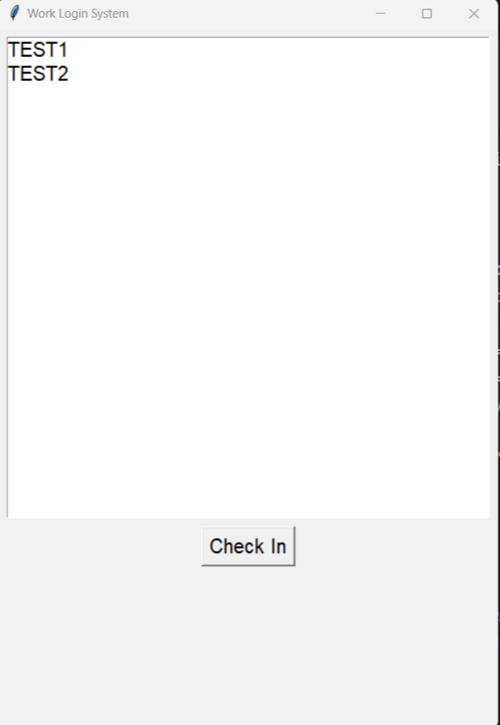
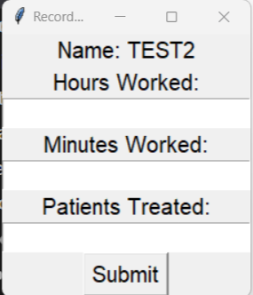

# Set up
### System requirements
- Python 3
- MySQL server 

### Commands
`pip install -r requirements.txt` 
`python setup.py`

# Program Descriptions
### `old-login-interface.py`
Used by the workers to indicate when their shift starts and when they leave their shift

### `new-login.py`
Used by the workers to indicate when their shift starts and when they leave their shift

### `front-desk-inferface.py`
- Search for information of the patient using name/ID
- Displays a list of patients and their next treatment date
- User can log new and existing patient information into the database

### `payment-interface.py`
- Search for information of the patient using name/ID
- Displays a list of patients and their prescribed medicine and treatments for the user to use and calculate for payment collection

### `doctor-interface.py`
- Search for information of the patient using name/ID
- Prescribe medicine and treatments, type out notes and set the next appointment through a simple GUI

### `wage-calculation.py`
Calculate the wage that each worker should be paid over a range of days through CLI

### `settings.py`
Modify the settings by updating MySQL database

